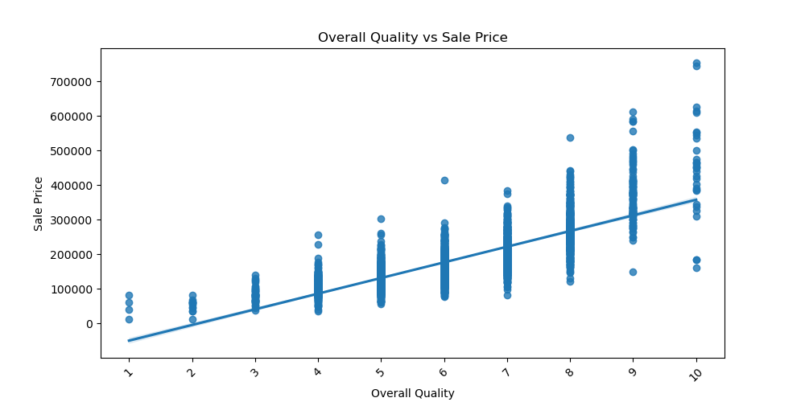
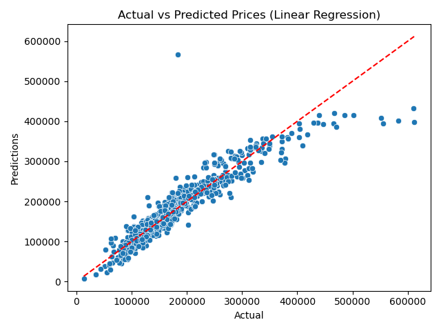

# Your Title Goes Here

## Problem Statement
- This dataset contains a list of different house prices in Ames, IA. 
- The purpose of this analysis is to determine if we can predict the price of a house, based on different features. 

## Data Dictionary
Here I will include a Data Dictionary of the different features I used in the modeling process. For a complete list of features, please see this file: [File](./data/DataDocumentation.txt)

| Column Name | Description |
|-------------|-------------|
| Column1     | Description1 |
| Column2     | Description2 |
| ...         | ...         |

## Executive Summary

### Data Cleaning Steps
Missing Data was filled in using the data dictionary. Many of the "missing" values actually represented a feature that wasn't part of that house. For example, Garage Quality had many missing values, but this meant that there was no garage. So using the data dictionary, I filled in the missing values with "No {feature_name}", where feature name is Garage, Basement, Pool, etc. 

Outliers were mostly left in the dataset so that the model would be able to learn from that data where some houses may have abnormally large square footage, basements, etc., as in turn, they may have higher prices. One outlier that was removed was a Garage Year Built, where the year was 2207. 

In the end, only 4 rows were removed, as it was not worth filling them in with a value. 

### Key Visualizations
Include key visualizations that highlight important aspects of the data. Use graphs, charts, or any other visual representation to make your points.

#### Visualization 1: Overall Quality vs Sale Price
This is a regression plot showing the relationship between overall quality and sale price. We can see a clear positive correlation, where as the quality of the house increases, so does the sale price. This was the strongest correlation in the dataset. 

## Model Performance

### Model Selection
For this project, I used Linear Regression as the main modeling algorithim. I also used Ridge and Lasso regression fro regularization, but this had minimal effect and performed the same/worse than linear regression (depending on the alpha).

I also used Decision Tree Regression, Linear SVR (Support Vector Regression), and Random Forest Regression for comparison. 

### Evaluation Metrics
Summarize the performance of the model(s) using key evaluation metrics (e.g., RMSE, R²).

| Model             | RMSE     | R²       |
|-------------------|----------|----------|
| Linear Regression | 30,019   | 0.86     |
| Decision Tree Regression  | 33,615  | 0.83  |
| Linear SVR | 45,258 | 0.69 |
| Random Forest Regression | 22,677 | 0.92 |

#### Visualization 2: Actual vs Predicted Pricing (Linear Regression)
This is a scatterplot of the actual prices on the X-axis, and my model's predicted values on the Y-axis. We can see that my model is very accurate for the majority of the test set, but starts to get further from the actual price as the prices get higher. This may be due to random noise in the higher priced houses, or due to a combonation of features that were unused for the sake of performance. The red dashed line shows that the perfect model would be. 

### Kaggle Submissions (if applicable)
Mention the Kaggle competition results or leaderboard placement if relevant.

## Conclusions/Recommendations
With the features I chose to include, I was able to create a very strong prediction algorithim to accuarately predict housing prics within $30,000. From the features I included, many of them related to the quality/condition of different aspects of the house, like overall quality, exterior quality, kitchen quality, etc. as these all had strong positive correlations to the sale price. This indicates that the better quality of the house, the better the sale price would be. There should be professional teams that improve the quality of a home before it is put on the market. 

## Additional Information
Include any additional information, references, or resources that might be relevant for understanding the analysis.

---

Feel free to replace the placeholders with your actual content. Additionally, if you have images for your visualizations, make sure to replace the placeholder paths with the correct file paths or URLs.

Once you've filled in the content, save the file with a `.md` extension (e.g., `README.md`). You can use this Markdown file on platforms like GitHub to provide a well-structured README for your analysis.
